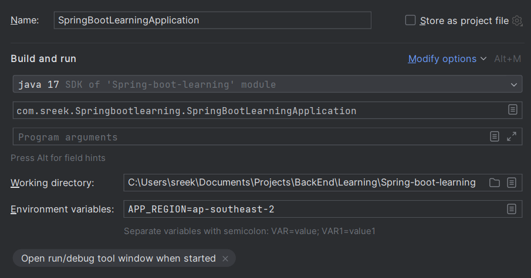

# Spring-boot-learning
Listing out the things I have learnt in Spring boot

- Application properties
- Logging
- Tips

### Application Properties
Several default behaviours by Spring boot can be overridden according to our need via properties in application properties

Steps to use custom properties in the application
- Add annotation @EnableConfigurationProperties({ApplicationProperties.class}) to the main class of your spring boot application  
- Create a class or record in the application and annotate it with @ConfigurationProperties(prefix = "app") where the prefix is the prefix of the properties that are custom to the application
  - For example, ApplicationProperties is the record which holds the custom properties of the application

#### Profiles
We can have different properties with several profiles in the application.  
- We can have properties change per profile by setting them in the appropriate file like application-dev.properties or application-qa.properties
- In here, we have application-p1.properties for profile1 and application-p2.properties for profile2

Update the property "spring.profiles.active=p1" in application.properties to select the profile we need.

### Logging
Logging is enabled by default in Spring boot.  
As we are using spring boot starter dependencies, Logback is used for logging by default.  

Customisation of logging can be performed using properties.  
Basic logging customisation via properties can be found in application-p1.properties.

SLF4J is used by Spring as a wrapper/interface with the underlying logging framework used for our application. In order to log information in our classes we - 
```
// import below in our class
import org.slf4j.Logger;
import org.slf4j.LoggerFactory;

// use the logging as below as a variable in the class
 private static final Logger logger = LoggerFactory.getLogger(DemoController.class);
 
// log where necessary in the code
logger.info("logging some information");
```

#### Mapped Diagnostic context
MDC is provided by logging libraries for performing audit logging.  
We can set the logging pattern as -  
"logging.pattern.console=%clr(%d{yyyy-MM-dd'T'HH:mm:ss.SSSXXX}){faint} %clr(%5p) %clr(${PID:- }){magenta}  %clr(UserId:%X{UserId:-Anonymous}){magenta} %clr(Context:%X){blue} %clr(---){faint} %clr([%15.15t]){faint} %clr(%-40.40logger{39}){cyan} %clr(:){faint} %m%n"  

Using above we can have MDC filter where we can add several variables using which we can insert data into the logs as "%clr(UserId:%X{UserId:-Anonymous}){magenta}" where UserId is a value added in MDCFilter.java  
We can add color to our variable as %clr(<variable_notation>){megenta}

#### Logging configuration order in Spring
In Spring Boot, the order of logging configuration that it accepts is:

- Logback configuration file (logback-spring.xml, logback-spring.groovy, or logback.xml)
- Log4j2 configuration file (log4j2-spring.xml or log4j2.xml)
- JDK Logging configuration file (logging.properties)
- Default configuration (INFO-level logging to the console)

Spring Boot will search for the above configuration files in the classpath and load them in the order listed above. If multiple configuration files are present, the first one found will be used. If no configuration file is found, Spring Boot will use the default configuration.

It's worth noting that Spring Boot also supports external configuration files for logging, such as application.properties or application.yml, which can be used to configure logging levels and other properties for specific packages or classes. These external configuration files take precedence over the default logging configuration but are still subject to the order of precedence for the various logging frameworks.

If you want your IntelliJ console to show colorized output as in the video add the property to the application.properties file - spring.output.ansi.enabled=ALWAYS

##### logback usage
Default logging framework for Spring boot is logback. If we want to customize things further using logback, we can create a file logback.xml in resources folder and Spring boot takes the configuration for it.

If we would like to use the properties in our properties file or environment variables and its values - we can use logback-spring.xml and use the tag <springProperty /> to access the specific property and use the same.

If we use profile where we have set logging properties using logback-spring.xml as the example in the resources folder - spring boot uses the configuration in both the application-p1.properties file and logback-spring.xml.

We can also send the app.region property via environment variables in run configuration1




##### log4j2 usage
In order to use log4j2, we have to first exclude default logging from the spring boot starter as -  

```
<dependency>
    <groupId>org.springframework.boot</groupId>
    <artifactId>spring-boot-starter-web</artifactId>
    <exclusions>
        <exclusion>
            <groupId>org.springframework.boot</groupId>
            <artifactId>spring-boot-starter-logging</artifactId>
        </exclusion>
        <exclusion>
            <groupId>org.yaml</groupId>
            <artifactId>snakeyaml</artifactId>
        </exclusion>
    </exclusions>
</dependency>
```
and include the below dependency
```
<dependency>
    <groupId>org.springframework.boot</groupId>
    <artifactId>spring-boot-starter-log4j2</artifactId>
</dependency>
```

To further use extensive configuration for log4j2, we can create a log4j2.xml file under resources' folder.

### Tips

**Autowired's annotation is not necessary when only one dependency is present**  
Starting with Spring 4.3, if a class, which is configured as a Spring bean, has only one constructor, the @Autowired annotation can be omitted and Spring will use that constructor and inject all necessary dependencies.

Regarding the default constructor: You either need the default constructor, a constructor with the @Autowired annotation when you have multiple constructors, or only one constructor in your class with or without the @Autowired annotation.

Read the https://docs.spring.io/spring/docs/4.3.x/spring-framework-reference/htmlsingle/#beans-autowired-annotation chapter from the official Spring documentation for more information.